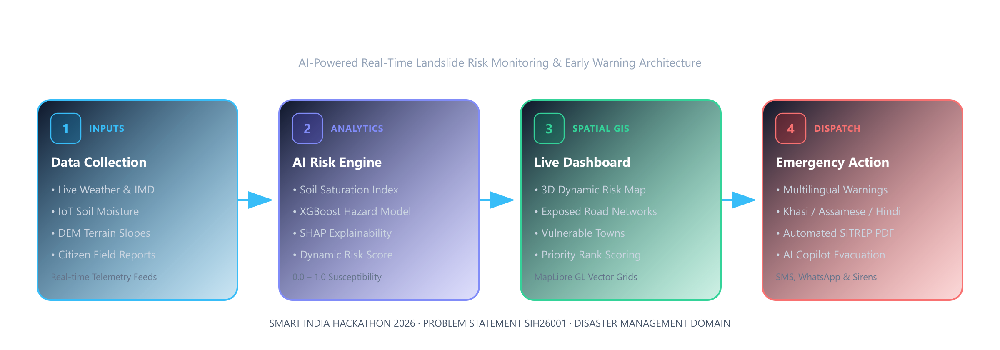

# LANDGUARD NER

<p align="center">
  
</p>

<p align="center">
  <strong>AI-Powered Real-Time Landslide Risk Monitoring & Early Warning Platform for the North Eastern Region of India</strong>
</p>

<p align="center">
  <a href="https://landguard-ner.netlify.app/"></a>
  
  
  
  
</p>

---

## Table of Contents
- [1. Executive Summary & Problem Context](#1-executive-summary--problem-context)
- [2. System Architecture](#2-system-architecture)
- [3. Complete Technology Stack](#3-complete-technology-stack)
- [4. Machine Learning & Geotechnical AI](#4-machine-learning--geotechnical-ai)
  - [4.1. Geotechnical Slope Failure Mechanics](#41-geotechnical-slope-failure-mechanics)
  - [4.2. Feature Extraction Pipeline](#42-feature-extraction-pipeline)
  - [4.3. Predictive XGBoost Model & Thresholds](#43-predictive-xgboost-model--thresholds)
  - [4.4. Explainable AI (XAI) via SHAP](#44-explainable-ai-xai-via-shap)
  - [4.5. Response Prioritisation Score](#45-response-prioritisation-score)
- [5. Google Gemini 1.5 Flash Multimodal Suite](#5-google-gemini-15-flash-multimodal-suite)
  - [5.1. Geotechnical Computer Vision Defect Analyzer](#51-geotechnical-computer-vision-defect-analyzer)
  - [5.2. Automated NDMA Situation Report (SITREP) Generator](#52-automated-ndma-situation-report-sitrep-generator)
  - [5.3. Context-Aware Disaster Copilot](#53-context-aware-disaster-copilot)
- [6. Key Platform Features](#6-key-platform-features)
- [7. 8-Step Interactive SIH Jury Demo Flow](#7-8-step-interactive-sih-jury-demo-flow)
- [8. Repository Directory Structure](#8-repository-directory-structure)
- [9. Quick Start & Local Setup](#9-quick-start--local-setup)
- [10. Competitive Differentiators](#10-competitive-differentiators)

---

## 1. Executive Summary & Problem Context

The **North Eastern Region (NER) of India** (*Meghalaya, Assam, Mizoram, Manipur, Nagaland, Arunachal Pradesh, Sikkim, and Tripura*) contains some of the highest landslide densities globally. Driven by intense orographic monsoons (including Cherrapunji and Mawsynram), steep young mountainous geology, tectonic activity, and rapid slope excavation, landslides regularly cause severe humanitarian crises.

Key lifeline transport corridors such as **NH-6** (Shillong–Sohra–Silchar, connecting Meghalaya, Assam, Mizoram, and Tripura), **NH-40** (Guwahati–Shillong), and **NH-54** (Haflong–Aizawl) suffer seasonal collapse, isolating populations from healthcare, emergency response, and essential supply chains.

### Limitations of Current Systems
* **Coarse Spatial Resolution:** Conventional warnings are issued at the broad district level rather than slope-scale or corridor-scale.
* **Delayed Response:** Relies solely on historical rainfall averages without considering real-time soil moisture pore-pressure dynamics.
* **Black-Box Confusion:** Emergency authorities lack granular reasoning for *why* an alert was issued.
* **Language Barriers:** Standard advisories often fail to reach local indigenous communities in regional dialects.

### The LANDGUARD Solution
LANDGUARD NER combines **meteorological satellite feeds**, **capacitive IoT ground sensors**, **high-resolution terrain models (DEM)**, **8,546 historical Geological Survey of India (GSI) records**, and **crowdsourced field reports** into an explainable ML risk engine with automated multilingual early warning dispatches.

---

## 2. System Architecture

```
┌────────────────────────────────────────────────────────────────────────────────────────┐
│                                   LANDGUARD NER PIPELINE                               │
└────────────────────────────────────────────────────────────────────────────────────────┘
            │                                                                │
            ▼                                                                ▼
┌───────────────────────────────┐                              ┌───────────────────────────────┐
│     DATA & TELEMETRY INGEST   │                              │     GEOSPATIAL TERRAIN MODEL  │
│  • OpenWeatherMap API         │                              │  • SRTM 30m DEM Ingestion     │
│  • 1h, 3h, 6h, 24h Rainfall   │                              │  • Slope, Aspect, Curvature   │
│  • IoT Soil Moisture Sensors  │                              │  • Topographic Wetness (TWI)  │
│  • 8.5k GSI Landslide Events  │                              │  • Lithology & Highway Buffer │
└──────────────┬────────────────┘                              └───────────────┬───────────────┘
               │                                                               │
               └───────────────────────────────┬───────────────────────────────┘
                                               ▼
                               ┌───────────────────────────────┐
                               │       AI RISK ENGINE (ML)     │
                               │  • XGBoost GBDT Classifier    │
                               │  • SHAP Localized XAI         │
                               │  • Triage Prioritisation      │
                               └───────────────┬───────────────┘
                                               │
                                               ▼
                               ┌───────────────────────────────┐
                               │   MULTIMODAL AI (GEMINI 1.5)  │
                               │  • Field Photo Defect Vision  │
                               │  • Automated NDMA SITREP      │
                               │  • Real-Time Copilot Chatbot  │
                               └───────────────┬───────────────┘
                                               │
                                               ▼
┌────────────────────────────────────────────────────────────────────────────────────────┐
│                               OPERATIONAL COMMAND DASHBOARD                            │
│  • MapLibre GL 60FPS Spatial Canvas        • 4 Clean Watermark-Free Basemaps           │
│  • 400 Dynamic AI Hazard Cells             • 8,546 GSI Landslide Point Clusters        │
│  • CAP Multilingual Alerts (EN, HI, Local) • Offline-First Field Incident Reporting   │
└────────────────────────────────────────────────────────────────────────────────────────┘
```

---

## 3. Complete Technology Stack

| Layer | Technologies Used | Purpose & Responsibilities |
|---|---|---|
| **Frontend Framework** | **Next.js 16 (App Router, Turbopack)**, **React 19**, **TypeScript** | Hybrid SSR/client application, zero-delay route rendering, API route proxying. |
| **Styling & Design** | **Tailwind CSS**, **Vanilla CSS**, **Lucide Icons** | Glassmorphic dark command center aesthetic, micro-animations, accessible UI tokens. |
| **Mapping Engine (GIS)** | **MapLibre GL JS**, Web Workers (`maplibre-gl-worker.mjs`), GeoJSON | 60 FPS vector map rendering, 400 AI hazard grid cells, 8.5k point clustering. |
| **Analytics Visualizers** | **Recharts** | Historical landslide timeline visualizers, rainfall vs. risk correlation curves. |
| **Backend API** | **FastAPI (Python 3.10+)**, **Uvicorn**, **Pydantic v2** | High-concurrency async REST API, strict schema validation, mathematical calculations. |
| **Database & ORM** | **PostgreSQL + PostGIS (Supabase)**, **SQLAlchemy 2.0 (Async)**, **SQLite** | Geospatial queries (`ST_DWithin`, `ST_MakePoint`), spatial indexes, persistence. |
| **Authentication & RBAC** | **Supabase Auth (Google OAuth + Email)**, Row Level Security (RLS) | 4 user roles: `ADMIN`, `AUTHORITY` (DDMA/SDMA), `FIELD_OFFICER` (SDRF/PWD), and `CITIZEN`. |
| **Machine Learning & AI** | **XGBoost / LightGBM**, **SHAP (XAI)**, **Google Gemini 1.5 Flash** | Slope stability prediction, localized feature attribution, multimodal defect inspection, copilot. |
| **Cloud Hosting & CI/CD** | **Netlify**, `@netlify/plugin-nextjs`, **GitHub Actions** | Automated production edge deployments on push to `main`. |

---

## 4. Machine Learning & Geotechnical AI

### 4.1. Geotechnical Slope Failure Mechanics
Slope stability along hill cuts is governed by the factor of safety ($FS$) based on the infinite slope equilibrium formulation:

$$FS = \frac{\tau_f}{\tau_d} = \frac{c' + (\gamma z - u_w) \cos^2 \beta \tan \phi'}{\gamma z \sin \beta \cos \beta}$$

Where:
* $c'$: Effective soil cohesion.
* $\phi'$: Effective internal friction angle.
* $\beta$: Slope angle (derived from DEM).
* $\gamma$: Unit soil weight; $z$: Soil mantle depth.
* $u_w$: Pore-water pressure (directly elevated by intense rainfall $R_{24h}$ and soil moisture saturation $S_m$).

When $u_w$ rises during monsoon cloudbursts, effective normal stress approaches zero, triggering rapid translational slope failures.

### 4.2. Feature Extraction Pipeline
The ML model substitutes closed-form analytical assumptions with an **XGBoost (Extreme Gradient Boosting)** classifier over a 12-dimensional multivariate feature vector:

$$\mathbf{x} = \big[ R_{1h}, R_{3h}, R_{6h}, R_{24h}, R_{3d}, R_{7d}, S_m, \beta, TWI, K_c, D_{GSI}, L_{type} \big]$$

1. **Precipitation Indices:** Short-term ($R_{1h}, R_{3h}, R_{6h}, R_{24h}$) for debris flows + long-term antecedent moisture ($R_{3d}, R_{7d}$) for deep rotational slides.
2. **Topographic Features (SRTM DEM):**
   * $\beta$ (**Slope Angle**): Critical shear failure angle ($\beta > 30^\circ$ represents high susceptibility).
   * **Topographic Wetness Index (TWI):** $TWI = \ln\left(\frac{\alpha}{\tan \beta}\right)$ (identifies natural subsurface drainage convergence).
   * **Profile & Planform Curvature ($K_c$):** Distinguishes concave slope hollows where runoff accumulates.
3. **IoT Capacitive Moisture ($S_m$):** Real-time volumetric water content (VWC %) from in-situ sensor telemetry.
4. **Historical Distance ($D_{GSI}$):** Spatial distance and density relative to 8,546 historical GSI landslide scars.

### 4.3. Predictive XGBoost Model & Thresholds
The model outputs a continuous failure probability $P \in [0, 1]$ mapped to 4 operational tiers:
* **0.00 – 0.25 (LOW - Green):** Stable slope, routine monitoring.
* **0.26 – 0.50 (MODERATE - Yellow):** Elevated soil moisture; advisory to PWD road maintenance teams.
* **0.51 – 0.75 (HIGH - Orange):** Active pore-pressure surge; inspect cut-slopes, restrict heavy trucks on NH-6.
* **0.76 – 1.00 (CRITICAL - Red):** Imminent slope failure; mandatory civil defense evacuation and SDRF staging.

### 4.4. Explainable AI (XAI) via SHAP
To ensure actionable transparency for District Magistrates and disaster commanders, the system calculates localized SHAP (SHapley Additive exPlanations) values for every grid cell:
* **24h Antecedent Rain:** Contributes **+40%** to the risk score during heavy storms.
* **Slope Steepness (DEM):** Contributes **+22%** baseline structural susceptibility.
* **Soil Saturation Index:** Contributes **+30%** when capacitive sensors report ground saturation.
* **Historical Inventory Proximity:** Contributes **+12%** based on GSI catalog density.

### 4.5. Response Prioritisation Score
$$\text{Priority Score} = \left( P \times 50 \right) + \left( \min\left(\frac{\text{Pop Exposed}}{10,000}, 1.0\right) \times 30 \right) + \left( W_{\text{corridor}} \times 20 \right)$$
*(where $W_{\text{corridor}} = 1.0$ for National Highways like NH-6, $0.7$ for State Highways, and $0.4$ for rural roads).*

---

## 5. Google Gemini 1.5 Flash Multimodal Suite

### 5.1. Geotechnical Computer Vision Defect Analyzer
* When field officers upload photos of slope movement or cracks, the image is passed to `gemini-1.5-flash` via [`frontend/src/lib/gemini.ts`](frontend/src/lib/gemini.ts).
* The model inspects geotechnical deformation indicators (*tension cracks along road shoulders, mud flow, rockfall debris, water seepage*).
* Returns structured JSON with defect classification, hazard score (0–100), and immediate civil defense protocols:
  ```json
  {
    "incident_type": "CRACK",
    "severity": "HIGH",
    "hazard_score": 82,
    "geotechnical_summary": "Tension fracture detected along cut-slope shoulder with visible soil displacement and water seepage, indicating progressive slope instability.",
    "recommended_actions": [
      "Erect warning perimeter along road corridor",
      "Deploy SDRF technical inspection unit",
      "Divert heavy vehicular traffic from slope edge"
    ]
  }
  ```

### 5.2. Automated NDMA Situation Report (SITREP) Generator
* 1-click executive reporting compliant with National Disaster Management Authority (NDMA) standards.
* Automatically synthesizes antecedent rainfall, active alerts, exposed highway chainage, and affected populations into a formal briefing.

### 5.3. Context-Aware Disaster Copilot
* Embedded AI chat assistant drawer ([`DisasterCopilot.tsx`](frontend/src/components/copilot/DisasterCopilot.tsx)) answering real-time operational questions such as:
  * *"Is the NH-6 corridor safe for travel tonight?"*
  * *"What villages are in the critical risk zone in East Khasi Hills?"*
  * *"What immediate evacuation protocols are recommended?"*

---

## 6. Key Platform Features

1. **Interactive Spatial MapLibre Engine:**
   - **400 AI Risk Cells:** 20×20 dynamic grid across the Shillong Plateau and highway corridors.
   - **8,546 GSI Landslide Dots:** Interactive point cluster visualization of historical ground failures with dates, triggers, and fatalities.
   - **4 Watermark-Free Basemaps:**
     - 🌑 **Cyber Dark Mode** (*Default — command center aesthetic*).
     - 🛰️ **Satellite Hybrid HD** (*Photorealistic mountain terrain with clear highway labels*).
     - ⛰️ **Topographic Relief** (*Contour hillshading for elevation analysis*).
     - 🗺️ **OpenStreetMap** (*Free standard road and street view*).
   - **1-Click Basemap Toggle:** Located at the top-right to instantly alternate between Satellite and Dark Canvas.

2. **State & District Onboarding:**
   - On user login, users select their state and district across all 8 NER states (*e.g., Meghalaya → East Khasi Hills*).
   - Persists the selection to Supabase `user_metadata` and automatically pans/zooms the map camera to their specific jurisdiction.

3. **Multilingual Early Warning & CAP Dispatch:**
   - Implements the **Common Alerting Protocol (CAP)** standard used by NDMA and IMD.
   - Emergency broadcasts are delivered simultaneously in **English**, **Hindi**, and local regional dialects (**Khasi** and **Assamese**).

4. **Crowdsourced Field Reporting:**
   - Offline-capable ground incident reporting with photo upload and automatic synchronization when network is restored.

---

## 7. 8-Step Interactive SIH Jury Demo Flow

Built into the dashboard ([`DemoScenarioController.tsx`](frontend/src/components/demo/DemoScenarioController.tsx)) to demonstrate the full crisis escalation cycle:

| Step | State | Trigger | System Response |
|---|---|---|---|
| **1** | Normal Conditions | 15mm rain, dry soil | Baseline monitoring, risk at 24% (LOW). |
| **2** | Heavy Rain Detected | 85mm rainfall in 6h | Risk elevates to 51% (HIGH); Yellow advisory issued. |
| **3** | Soil Moisture Surge | Sensor moisture hits 83% | Ground saturation detected; risk jumps to 76% (HIGH). |
| **4** | AI Critical Warning | Stressors converge | 89% CRITICAL RED ALERT triggered on Sohra corridor. |
| **5** | Exposure Analysis | Spatial GIS query | Identifies 3 villages, NH-6, 2 bridges, and 5,200 people. |
| **6** | Response Prioritisation | Triage algorithm | East Khasi Hills flagged as Rank #1 priority zone. |
| **7** | Field Report Received | Officer uploads crack photo | Gemini 1.5 Vision confirms slope scarp; SDRF alerted. |
| **8** | Multilingual Broadcast | CAP dispatcher | Red alert broadcast in English, Hindi, and Khasi. |

---

## 8. Repository Directory Structure

```
g:\SIH26001
├── backend/
│   ├── app/
│   │   ├── main.py                     # FastAPI application initialization & routes
│   │   ├── database.py                 # Async SQLAlchemy engine & session factory
│   │   ├── models/models.py            # ORM tables: RiskPrediction, LandslideEvent, Alert, Road, Village
│   │   ├── routers/
│   │   │   ├── risk.py                 # Risk calculation, 400-point spatial grid, SHAP explanations
│   │   │   ├── alerts.py               # Multilingual CAP alerts (EN, HI, Local)
│   │   │   ├── demo.py                 # 8-step SIH Hackathon simulation controller
│   │   │   ├── reports.py              # Crowdsourced field incident reporting
│   │   │   └── landslides.py           # Historical GSI inventory queries
│   │   ├── services/
│   │   │   ├── seed.py                 # Seeds GSI events, roads, villages, and sensor nodes
│   │   │   └── supabase_service.py     # PostGIS & Supabase integration
│   │   └── data/
│   │       └── gsi_ner_landslides.json # 8,546 GSI landslide records
│   ├── requirements.txt                # Python dependencies
│   └── supabase_schema.sql             # Production PostgreSQL schema with PostGIS & RLS
│
├── frontend/
│   ├── src/
│   │   ├── app/
│   │   │   ├── page.tsx                # Main single-page command dashboard
│   │   │   ├── layout.tsx              # Root HTML wrapper with fonts and metadata
│   │   │   └── api/                    # Next.js App Router API proxy routes
│   │   │       ├── risk/grid/route.ts  # Serves 400-cell spatial grid
│   │   │       ├── demo/route.ts       # Manages 8-step live demo state
│   │   │       ├── alerts/route.ts     # Serves active emergency notifications
│   │   │       └── reports/route.ts    # Field report submission & retrieval
│   │   ├── components/
│   │   │   ├── map/RiskMap.tsx         # MapLibre GL engine, 4 basemaps, layer switcher, GSI dots
│   │   │   ├── auth/
│   │   │   │   ├── AuthModal.tsx       # Supabase Google OAuth & login modal
│   │   │   │   └── RegionOnboardingModal.tsx # District selection modal on first login
│   │   │   ├── copilot/DisasterCopilot.tsx # Interactive Gemini 1.5 chat drawer
│   │   │   ├── sitrep/SitrepModal.tsx  # 1-click executive NDMA SITREP generator
│   │   │   ├── demo/DemoScenarioController.tsx # 8-step interactive hackathon timeline
│   │   │   ├── reports/ReportModal.tsx # Geo-tagged field report & photo analysis
│   │   │   └── analytics/HistoricalAnalyticsModal.tsx # Recharts landslide trends & charts
│   │   ├── data/
│   │   │   ├── nerRegions.ts           # Geo-boundaries & corridors for all 8 NER states
│   │   │   └── gsi_curated_events.json # Bundled historical records for instant client loading
│   │   └── lib/
│   │       ├── gemini.ts               # Google Gemini 1.5 SDK wrapper (Vision + Copilot + SITREP)
│   │       ├── serverStore.ts          # In-memory resilient state store for zero-delay demo
│   │       └── supabase.ts             # Supabase JS client with automatic fallback
│   ├── public/
│   │   ├── maplibre-gl-worker.mjs      # Self-hosted CSP-compliant MapLibre web worker
│   │   └── maplibre-gl-shared.mjs      # Shared worker dependencies
│   └── package.json
│
├── docs/                               # High-resolution workflow diagrams and assets
├── netlify.toml                        # Production build configuration & environment
├── PROJECT_WALKTHROUGH.md              # In-depth technical architecture document
└── README.md                           # Main repository showcase
```

---

## 9. Quick Start & Local Setup

### 1. Clone the repository
```bash
git clone https://github.com/Anubhav2qrz/SIH26001.git
cd SIH26001
```

### 2. Backend Setup (FastAPI + Python 3.10+)
```bash
cd backend
python -m venv venv
venv\Scripts\activate          # Windows (or source venv/bin/activate on Linux/Mac)
pip install -r requirements.txt
python -m app.services.seed    # Seeds 8.5k GSI records, roads, and villages into SQLite
uvicorn app.main:app --host 127.0.0.1 --port 8000 --reload
```
*API documentation available at `http://127.0.0.1:8000/docs` (Swagger UI).*

### 3. Frontend Setup (Next.js 16 + TypeScript)
```bash
cd ../frontend
npm install
npm run dev
```
*Open `http://localhost:3000` in your browser.*

---

## 10. Competitive Differentiators

1. **Authentic Ground Truth:** Built with **8,546 verified Geological Survey of India (GSI)** landslide incidents across the NER rather than synthetic placeholders.
2. **Transparent Explainable AI (XAI):** Mathematical SHAP values explain *why* every alert was triggered, eliminating black-box uncertainty for disaster commanders.
3. **Multimodal Edge Intelligence:** Integrated Google Gemini 1.5 Flash for computer-vision geotechnical defect inspection and automated NDMA situation reporting.
4. **Resilient Offline Architecture:** Offline-first incident reporting queue that syncs automatically when network reconnects in remote valleys.
5. **Zero-Lag Vector Cartography:** 60 FPS vector tile rendering with custom bundled MapLibre workers and 4 watermark-free basemaps.

---

## License

Distributed under the **MIT License**. See `LICENSE` for more information.
